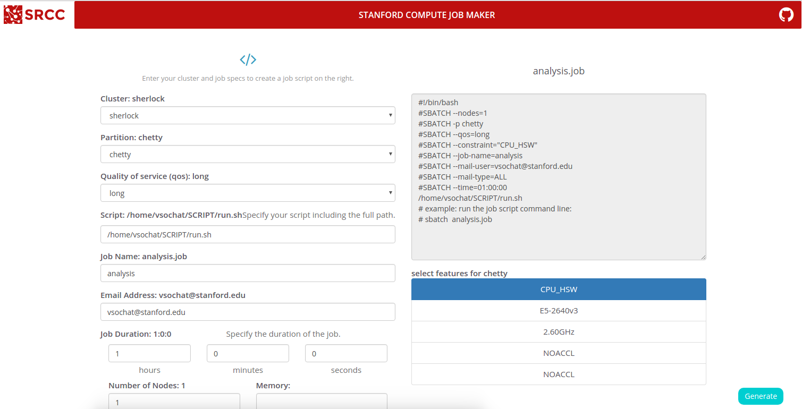

# Job Maker

Making SLURM (or other) job scripts to submit jobs to a 
[SLURM cluster](https://en.wikipedia.org/wiki/Slurm_Workload_Manager) is annoying. 
Research Computing at Stanford, [inspired by NERSC](https://my.nersc.gov/script_generator.php), 
have created this static tool that you (some cluster admin) can tweak the 
configuration for, and then serve statically for your users.

[The Job Maker](https://researchapps.github.io/job-maker/)



## What does it do?

Give the [demo](https://researchapps.github.io/job-maker/) a try! Essentially, 
you have a simple web interface to help your users generate job scripts to 
submit on your cluster(s). This comes together with a static [index.html](index.html), 
a [javascript backend](assets/js/script.js) driven by [Vue.js](https://vuejs.org/), 
and a small [helper script](helpers/slurm2json.py) to generate the required 
[data](data) to run the application.


## The Machines.json Data Structure
We parse the [slurm.conf](https://slurm.schedmd.com/slurm.conf.html) to generate a single data structure that has this hierarchy:

```
- cluster1

   - partitions
      - partition1
      .
      .
      .
      - partitionN

  - nodes
      - node1
      .
      .
      . nodeN

  - features
     - partition1
     .
     .
     - partitionN

  - defaults
    - nodes
    - partitions
.
.
- clusterN
  
```

### Parititions
A partition is a group of nodes with a particular qos (quality of service), with 
defaults for time, maximumm memory, and memory per CPU. For example, `slurm2json.py` 
will return this for my graduate school lab's partition:

```
{ "russpold"
             {'AllowQos': 'normal,russpold,russpold_interactive,system',
              'DefMemPerCPU': '8000',
              'DefaultTime': '2:0:0',
              'MaxMemPerCPU': '8192',
              'PartitionName': 'russpold',
              'maxNodes': 16}
}
```

### Nodes
A node of course, is a node. It usually is associated with one or more partitions, 
which means different groups are allowed to use it. `slurm2json.py` might parse a 
node that looks like this:

```
'sh-18-25': {'Feature': '"CPU_HSW,E5-2640v3,2.60GHz,NOACCL,NOACCL"',
  'RealMemory': '64000',
  'Weight': '100071',
  'partitions': ['normal',
                 'russpold',
                 'owners']}
```

### Features
Features are attributes for a node, that (I think) we are allowed to define. 
For this application, I decided to make Features indexed by partitions, so when 
the user selects a partition, we can look up features available for it.  Here are 
features available for the `russpold` partition:

```
 'russpold': ['CPU_IVY', 'E5-2650v2', '2.60GHz', 'NOACCL', 'NOACCL'],
```

### Defaults
I noticed that some partitions and nodes have a "Default" indicator as a variable, 
and so I parse a lookup for defaults, for each general category of `partitions`, 
and `nodes`. In the case of my test file, I found that `normal` was the default partition:

```
{'nodes': [], 'partitions': ['normal']}
```

And I would then select this partition for the user if he/she did not select one.
 I (@vsoch) came up with the organization primarily to be able to look things up 
in the web interface as needed. There are definitely other ways to go about it.


## Why slurm.conf?
I chose to parse the `slurm.conf` and not require any additional permissions (e.g., 
reading a database or using any command that requires root) so that any slurm user 
can generate the structure. You can of course imagine other organizations, or 
even uses for this data structure outside of this small application, and if you 
want to chat please [post an issue](https://www.github.com/researchapps/job-maker/issues)!


# Configuration

The configuration and specification for your cluster is defined by files in the 
[assets/data](assets/data) folder. We generated these files from the `slurm.conf` 
directly, which is usually located at `/etc/slurm/slurm.conf`. You have a few 
options for generating these data files:

## Option 1. Docker

We've provided a [Dockerfile](docker/Dockerfile) in this repository that
will generate the entire compressed output for you! The container
is available on [Docker Hub](https://cloud.docker.com/repository/registry-1.docker.io/vanessa/job-maker). First, create a temporary directory to bind to the container:

```bash
mkdir -p /tmp/jobmaker
```

Next, copy your slurm.conf there.

```bash
cp slurm.conf /tmp/jobmaker
```

Finally, run the container, bind this directory to `/data` in the container,
and provide the path to slurm.conf (from within the container):

```bash
docker run --volume /tmp/jobmaker:/data vanessa/job-maker --input /data/slurm.conf
Parsing /data/slurm.conf, please wait!
All partitions will be included.
Adding cluster sherlock
Compiling clusters sherlock
Successful generation! Writing output to /data...
/data
├── LICENSE
├── README.md
├── assets
├── data
├── index.html
└── slurm.conf

2 directories, 4 files
```

You should then be able to copy those static files to your web server, and deploy 
the job maker. You can also test locally with python:

```bash
cd /tmp/jobmaker
python -m http.server 9999
```

If you want to change the logo, just replace the file at `assets/img/logo.png`.
You can also tweak the colors and styling of the page in `assets/css/style.css`.
For example, to change the color (red) of the navigation bar, change the
background-color here:

```css
nav {
    display: inline-block;
    margin-left: 50px auto;
    background-color: #be100f;
    border-radius: 2px;
    width: 90%;
}
```

Have fun! The same customizations to the slurm2json.py command can be given to the 
entrypoint, with the one exception of `--outfile`. Since we need to generate
the file in a predictable place inside the container, you shouldn't set this
because it's set for you.

## Option 2. Manual

If you don't want to generate the file programatically, you can manually enter 
values for your cluster. A template / example file for you to start from is
provided in [helpers/templates](helpers/templates).

## Option 3. Local

In the helpers folder, we have provided a command line executable, 
[slurm2json.py](helpers/slurm2json.py) that can be run with the `slurm.conf` 
to generate the required data files. You have a few ways to run this, 
depending on the number of clusters and level of filtering you want to apply 
to each. First, take a look at the usage:


```
python slurm2json.py --help
usage: slurm2json.py [-h] [--input INPUT] [--update]
                     [--disclude-part DISCLUDE_PART] [--print] [--force]
                     [--outfile OUTFILE]

convert slurm.conf to machines.json

optional arguments:
  -h, --help            show this help message and exit
  --input INPUT         path to one or more slurm config files, separated by
                        commas. Default is one slurm.conf in present working
                        directory.
  --update              Update an already existing machines.json (or other)
  --disclude-part DISCLUDE_PART
                        Partitions to disclude, separated by commas
  --print               print to screen instead of saving to machines.json
  --force               Force overwrite of the output file, if it exists.
  --outfile OUTFILE     output json file. Default is machines.json
```

#### Quick Start

If you need to generate a `machines.json` for one cluster, the simplest 
thing to do would be to cd to the folder with your `slurm.conf`, and generate the file:

```
git clone https://www.github.com/researchapps/job-maker
cd job-maker/helpers
cp /etc/slurm/slurm.conf $PWD
python slurm2json.py
```

And there are many tweaks that you can do to this basic command by way of the following options.


#### Options


###### Output File

If you want to change the name of the output file, specify it:

```
python slurm2json.py --outfile cluster.json
```

###### Input files
Or if you want to change the name of the input file, that works too:

```
python slurm2json.py --input slurm-corn.conf
```

You can also specify more than one slurm configuration for input, and they will 
both be parsed as separate clusters in the `machines.json` output file.

```
python slurm2json.py --input slurm-corn.conf,slurm.conf
```

###### Force
By default, if you have a `machines.json` already existing and you try to 
overwrite it, you will get an error:

```
python slurm2json.py
machines.json already exists! Use --force to force overwrite.
```

But if you make a mistake and need to overwrite (or want the script to run 
automatically and force update the file) just use force:

```
python slurm2json.py --force
Parsing slurm.conf, please wait!
All partitions will be included.
Adding cluster sherlock
Compiling clusters sherlock
```

###### Quiet
You can suppress all output with `--quiet`.

```
python slurm2json.py --input slurm.conf --quiet
```

Note that `--quiet` will not suppress error messages that would cause the program to exit. 


###### Preview
If you aren't ready to write to file, you can preview the output by appending `--print`

```
python slurm2json.py --input slurm.conf --print
```

When used with `--print`, the message output will not be included with the 
print so that you could pipe the output to file, if desired:

```
python slurm2json.py --input slurm.conf --quiet >> output.json
```

Whatever floats yer' boat, Harry.


#### Filters
It might be the case that you want to disclude particular partitions. To do this, 
simply specify their names:


```
# One
python slurm2json.py --disclude-partition normal

# Multiple
python slurm2json.py --disclude-partition normal,dev
```


#### Multiple Clusters
Most institutions have multiple clusters, and would want their users to be able 
to select a cluster, and then filter down. To specify the `machines.json` to be 
generated for multiple clusters, you should specify the `--input` command, but 
provide several comma separated slurm configuation files:

```
python slurm2json.py --input slurm.conf,slurm-corn.conf
Parsing slurm.conf,slurm-corn.conf, please wait!
All partitions will be included.
Adding cluster sherlock
Adding cluster farmshare2
Compiling clusters sherlock,farmshare2
```

#### Multiple Clusters with Filters
If you have a filter to apply across all clusters, then you can generate as above, 
and add the filter:

```
python slurm2json.py --input slurm.conf,slurm-corn.conf --disclude-part normal,dev
```

and in the example above, `normal` and `dev` would be discluded from both clusters 
defined in the two configuration files, given that they exist. However, if you have 
two clusters with a shared name but you only want to disclude a partition 
from one, then you should generate the `machines.json` for one cluster, and 
update it by adding the second. To do this you first generate `machines.json` 
for your first file:

```
python slurm2json.py --input slurm.conf                                  # include normal and dev
python slurm2json.py --input slurm.conf                                  # include normal and dev
Parsing slurm.conf, please wait!
All partitions will be included.
Adding cluster sherlock
Compiling clusters sherlock
```

And then update with the second:

```
python slurm2json.py --input slurm-corn.conf --update --disclude-part normal,dev # do not include
Parsing slurm-corn.conf, please wait!
Found machines.json to update.
normal, dev will not be included.
Adding cluster farmshare2
Compiling clusters farmshare2,sherlock
```

You can use the update command, of course, to update or add a new cluster. 
If I run the above command again with a cluster already represented with `--update`, 
the entire cluster entry will be updated. Since `--update` by default must update 
an existing file, `--force` is implied, and an error message is issued if the file 
to update is not present..

If you need further functionality, please [create an issue](https://www.github.com/researchapps/job-maker/issues)

# Development

If you want to build the container locally, after cloning the repository
you should issue this command from the root of it:

```bash
$ docker build -f docker/Dockerfile -t vanessa/job-maker .
```

To interactively shell inside to test:

```bash
$ docker run --entrypoint bash -it vanessa/job-maker
```

If you want to test binding your temporary directory with a slurm.conf:

```bash
$ docker run --entrypoint bash --volume /tmp/jobmaker:/data -it vanessa/job-maker
# ls /data
slurm.conf
```

## Credits

 - [Research Computing](https://srcc.stanford.edu)
 - [Nersc](https://my.nersc.gov/script_generator.php)
